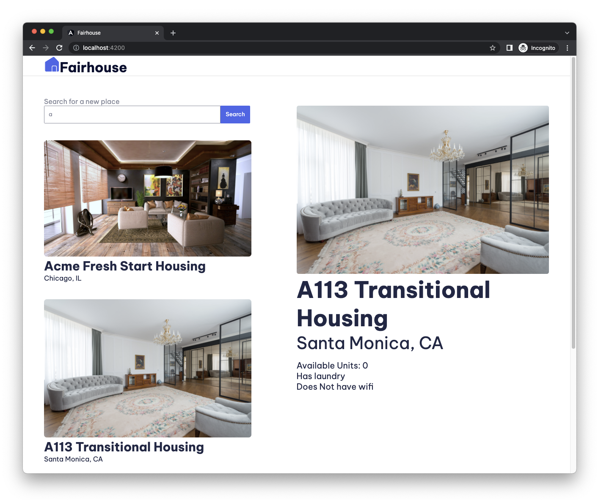

# Fairhouse

## Technologies used
* Angular

In this project, we'll build a housing app with Angular. The completed app will feature the ability to view home listings based on user search, and view details of a housing location.

We'll build everything with Angular using Angular's powerful tooling and great browser integration.

Here's a preview of the finished application:

